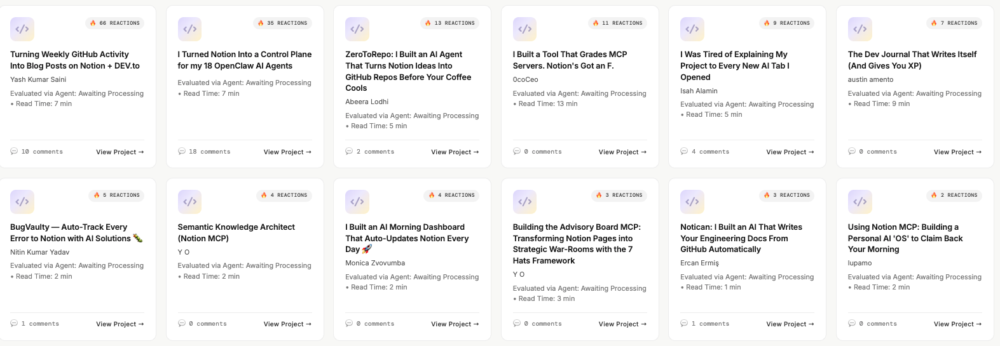

# 🏛️ Notion Judge's Glassboard

*A submission for the [Notion MCP Challenge](https://dev.to/challenges/notion-2026-03-04).*

A premium, cinematic **Evaluation OS** built to streamline and elevate the judging experience for the Notion MCP Challenge. With 180+ incredible submissions to evaluate across criteria like Originality, Complexity, and Practicality, the Glassboard transforms raw submission data into a highly aesthetic, two-stage React SPA — powered by live DEV.to API data and the Notion MCP.

---

## ✨ Screenshots

### Pastel Gallery Dashboard



---

## 🚀 What I Built

The **Notion Judge's Glassboard** is a bespoke evaluation hub designed to make the final judging process as impressive as the projects being evaluated. It is composed of two distinct experiences:

1. **The Cinematic Hero** — A sleek, fully animated dark-mode landing page with floating ambient particles and interactive SVG badges that make the project feel instantly premium.
2. **The Pastel Gallery** — A smooth, glassmorphism-inspired category dashboard that dynamically sorts submissions, surfacing read times, reaction counts, and direct links natively mapped to actual DEV.to articles.

---

## 🧠 How I Used Notion MCP

The architecture deeply leverages the **Notion MCP (Model Context Protocol)** as the autonomous backend state for AI agents throughout the build:

- **Autonomous DB Generation** — Antigravity and Claude agents hooked into Notion MCP via `stdio` to spin up the master judging database without leaving the terminal.
- **Dynamic Ingestion Pipeline** — Python scripts query live DEV.to data, structure it, and sync it locally. At runtime, MCP acts as the bridge connecting the React dashboards with structured Notion metric tables, enabling rapid scaling without hitting API bottlenecks during heavy judging workflows.
- **Human-in-the-Loop Validation** — All submissions ingested via agents carry a `securityHumanInLoop: true` flag, guaranteeing that final scores pushed back through MCP are authenticated by valid evaluators.

---

## 🛠️ Tech Stack

| Layer | Technology |
|---|---|
| Frontend | React 19, TypeScript, Vite |
| Animations | Framer Motion |
| Icons | Lucide React |
| HTTP Client | Axios |
| Data Source | DEV.to API + Notion MCP |
| Styling | CSS (glassmorphism, dark-mode) |

---

## 📦 Getting Started

### Prerequisites

- Node.js ≥ 18
- npm or yarn

### Install & Run

```bash
# Install dependencies
npm install

# Start the development server
npm run dev

# Build for production
npm run build

# Preview the production build
npm run preview
```

The app will be available at `http://localhost:5173` by default.

---

## 🗂️ Project Structure

```
src/
├── assets/          # Static assets and screenshots
├── App.tsx          # Root application component & routing logic
├── App.css          # Global app styles
├── Hero.tsx         # Cinematic hero landing page
├── Hero.css         # Hero page styles
├── ProjectCard.tsx  # Submission card component for the gallery
├── types.ts         # Shared TypeScript type definitions
├── index.css        # Base CSS reset and variables
└── main.tsx         # Application entry point
```

---

## 📄 License

MIT
